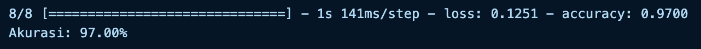
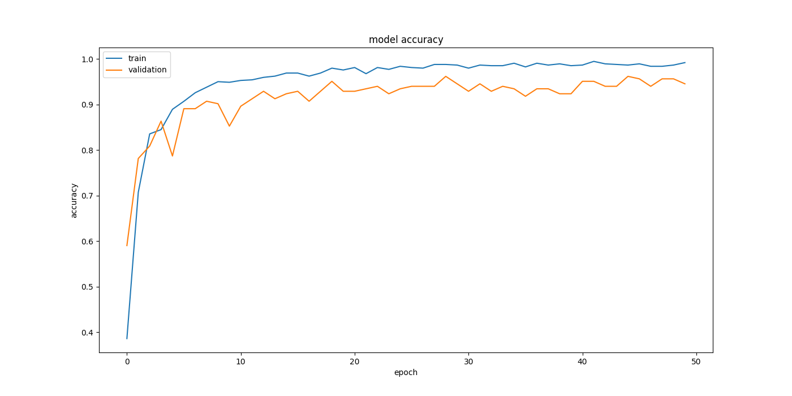
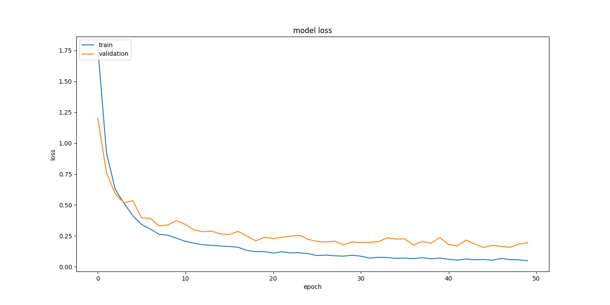

# DermaScan-ML
## DermaScan Skin Disease Classifier

## Author: 
- Annisa Aulia (M281D4KX1870)
-  Aulia Muzhaffar (M322D4KY2577)
- M. Ilhaam Ghiffari (M322D4KY3003)

## Project Overview

This project is focused on building and training a deep learning model to classify images of common skin disease. The project utilizes a dataset available on Kaggle, which consists of images of 8 types of common skin disease.

## Dataset

The dataset used in this project is the [Skin-Disease-Dataset](https://www.kaggle.com/datasets/subirbiswas19/skin-disease-dataset) available on Kaggle. It includes a good amount of images (around 1,100). In this dataset there are total 8 class ,They are:

1. Bacterial Infections - cellulitis
2. Bacterial Infections - impetigo
3. Fungal Infections - athlete -foot
4. Fungal Infections - nail-fungus
5. Fungal Infections - ringworm
6. Parasitic Infections - cutaneous-larva-migrans
7. Viral skin infections - chickenpox
8. Viral skin infections - shingles.

## Data Preparation
The dataset is downloaded using kaggle API, extracted, and divided into training validation and test sets

## Model Architecture
The model is a convolutional neural network (CNN) using transfer learning method with MobileNetV2.

## Training the Model
The model is trained using callbacks like EarlyStopping, and TensorBoard to optimize performance and prevent overfitting.

## Evaluation and Visualization
The model's performance is evaluated and visualized using Plotly. Graphs for loss and accuracy are plotted to understand the training and validation metrics over epochs.

## Accuracy

- The Train accuracy of this model is **98.65%**
- The Validation accuracy of this model is **96.17%**
- The Test accuracy of this model is **97.00%**

## Training graphs

## Tensorboard
TensorBoard logs, useful for detailed performance analysis, available under the **logs** folder.
